# Sudoku - Semester Project

## Description
This project is a **Sudoku game implemented using JavaFX** and developed as a **semester project**.
The main goal of the project is to demonstrate:

- JavaFX UI
- MVC architecture
- Java Collections
- Multithreading and concurrency
- Clear separation of responsibilities


## Technologies Used
- Java
- JavaFX
- Java Collections Framework
- Multithreading (`Task`, `Thread`)
- JavaFX CSS

## Architecture
The application is structured using an **MVC-based architecture**:

- **Model** – stores game data and application state
- **View** – JavaFX UI components
- **Controller** – handles user input and coordinates interaction between Model and View

A shared `AppContext` is used to manage global application state and screen switching.

## Project Structure

```
cz.cvut.fit.sudk
├─ SudokuApplication.java
│
├─ mvc
│  ├─ controllers
│  │  ├─ AppContext.java
│  │  ├─ GameLevel.java
│  │  ├─ LevelFactory.java
│  │  ├─ MainMenuController.java
│  │  └─ SudokuFieldController.java
│  │
│  ├─ models
│  │  ├─ Constants.java
│  │  ├─ LevelModelUtils.java
│  │  ├─ MainMenuModel.java
│  │  ├─ PlayerProgress.java
│  │  └─ SudokuFieldModel.java
│  │
│  └─ views
│     ├─ GameTools.java
│     ├─ MainMenuView.java
│     └─ SudokuFieldView.java
│
├─ SudokuGenerator.java
└─ resources
   └─ styles.css
```
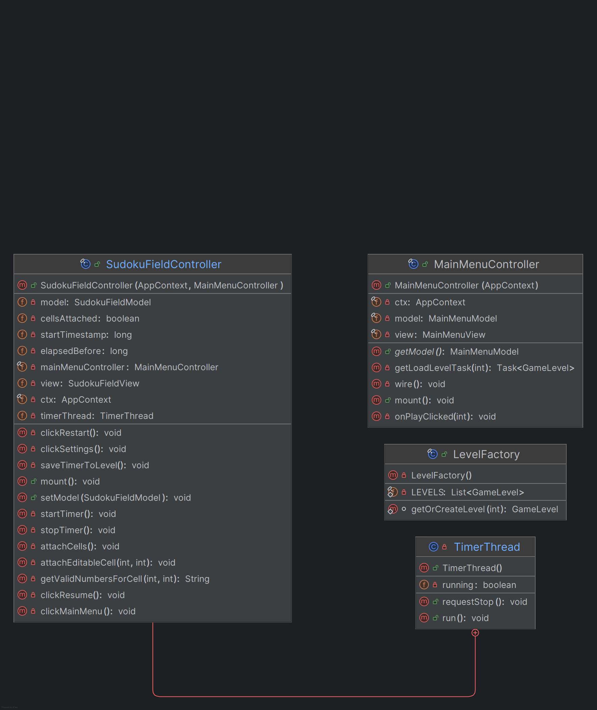
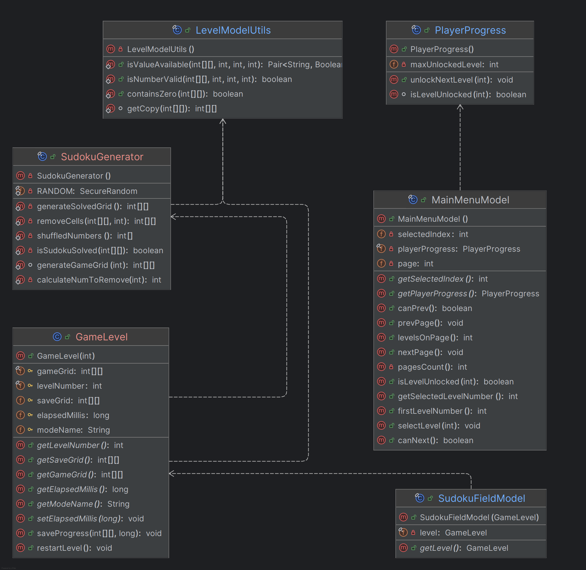
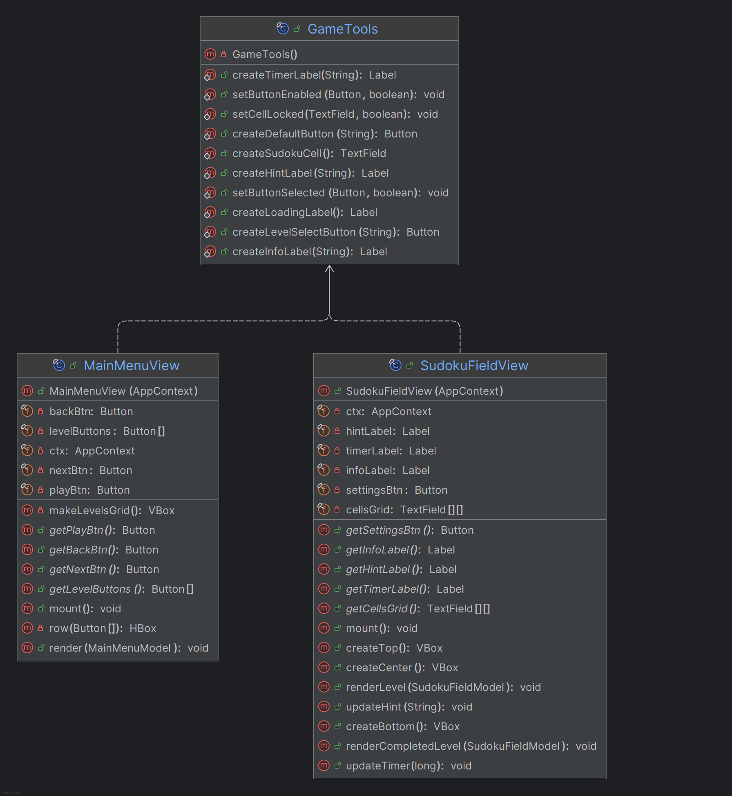

## Class Responsibilities

### SudokuApplication
- JavaFX application entry point (`extends Application`)
- Initializes the primary `Stage` and root layout
- Creates and initializes `AppContext`
- Displays the main menu on startup

### AppContext
- Shared application context
- Stores references to the primary `Stage` and root `BorderPane`
- Handles switching between screens (menu ↔ game)

### GameLevel
- Represents a single Sudoku level
- Stores the original grid, editable grid, level number, and difficulty
- Provides logic for resetting the level and checking completion

### LevelFactory
- Creates and manages `GameLevel` instances
- Uses `List<GameLevel>` as an internal cache
- Generates levels lazily using `SudokuGenerator`
- Ensures each level is created once and reused

### MainMenuController
- Handles user interaction in the main menu
- Connects `MainMenuView` with `MainMenuModel`
- Loads levels asynchronously using `javafx.concurrent.Task`
- Starts the game and switches screens via `AppContext`

### SudokuFieldController
- Main controller for the Sudoku game screen
- Processes user input from the grid
- Validates moves using `LevelModelUtils`
- Manages the game timer
- Detects level completion and unlocks new levels

### Constants
- Stores global configuration constants
- Eliminates magic numbers

### LevelModelUtils
- Utility class with static helper methods
- Deep copying Sudoku grids
- Validation of user input
- Checking Sudoku rules

### MainMenuModel
- Stores the state of the main menu
- Tracks available and selected levels
- Uses `PlayerProgress` to determine unlocked levels

### PlayerProgress
- Stores player progression
- Tracks the highest unlocked level
- Provides logic for unlocking new levels

### SudokuFieldModel
- Holds the currently active `GameLevel`
- Acts as the model for the Sudoku game screen

### GameTools
- Shared UI helper utilities
- Prevents code duplication across views

### MainMenuView
- JavaFX UI for the main menu
- Displays level selection and navigation controls
- Delegates actions to `MainMenuController`

### SudokuFieldView
- JavaFX UI for the Sudoku game
- Displays Sudoku grid, timer, and game status
- Forwards user interactions to `SudokuFieldController`

### SudokuGenerator
- Generates valid Sudoku grids
- Used by `LevelFactory`
- Ensures correctness of generated puzzles

## Multithreading & Concurrency

- Background level loading implemented using `javafx.concurrent.Task`
- Game timer implemented using a dedicated background thread
- UI updates executed safely using `Platform.runLater`

## Screenshots & Screen Description

This section provides an overview of the main application screens and their functionality.

### Main Menu – Level Selection (Pages 1–3)

**Page 1 (Levels 1–25)**  
The initial main menu screen displaying the first page of available levels.
The currently selected level is visually highlighted.

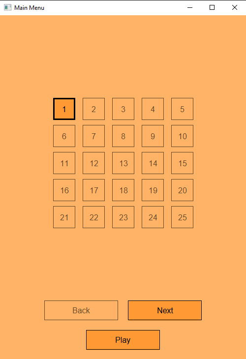

**Page 2 (Levels 26–50)**  
Navigation to the next page of levels using the *Next* button.

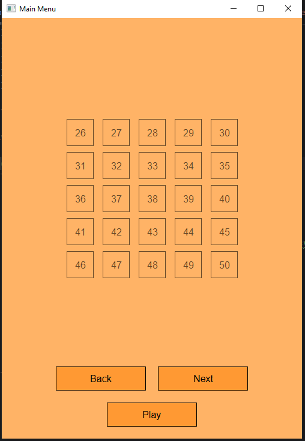

**Page 3 (Levels 51–65 and Locked Levels)**  
Levels beyond the player’s progress are displayed as locked (`?`).
The *Next* button is disabled when no further pages are available.

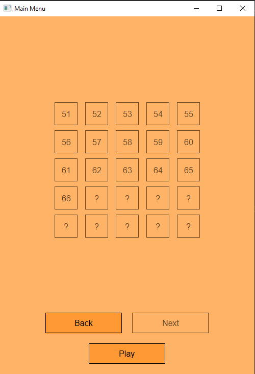

### Game Loading Screen

A temporary loading screen shown while the selected Sudoku level
is generated and initialized in a background thread.

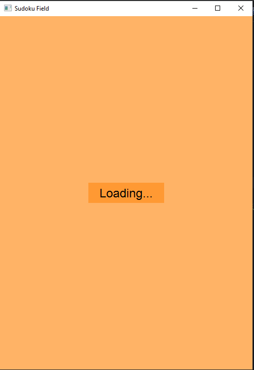

### Sudoku Game – Initial State

The main Sudoku game screen after successful loading of a level.
It displays:
- current time
- game mode and level number
- hint area with valid numbers for the selected cell


### Valid Input Feedback

After entering a valid number, the game displays a confirmation
message informing the player that the move is correct.

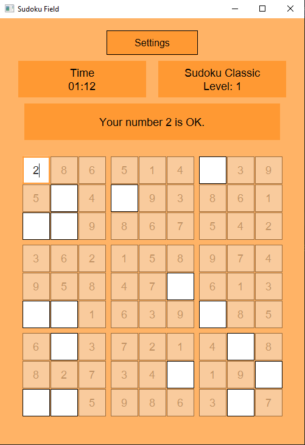

### Rule Violation Feedback

If the entered number violates Sudoku rules (row, column, or 3×3 square),
an error message is displayed in the hint area.

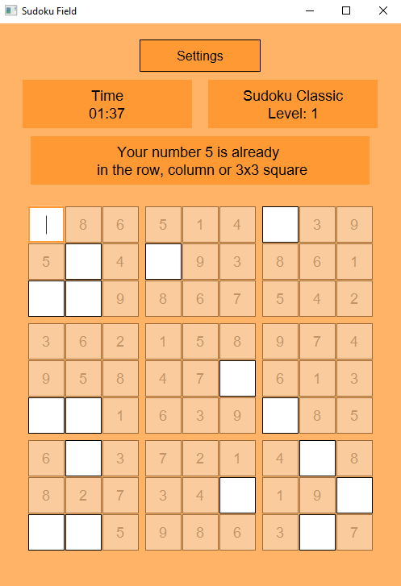

### Invalid Input Handling

If the player enters a value outside the allowed range (1–9),
the game informs the player about the invalid input.

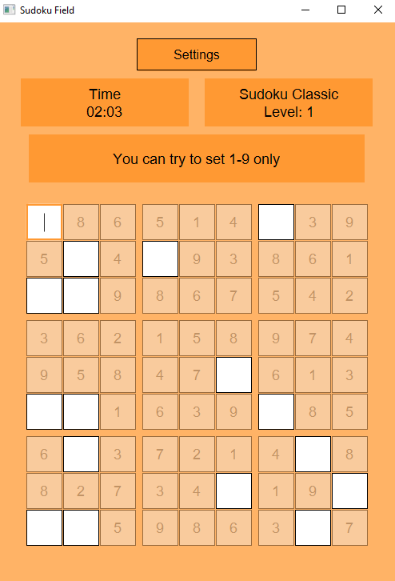

### Settings / Pause Menu

The settings screen allows the player to:
- return to the current game
- restart the level
- navigate back to the main menu

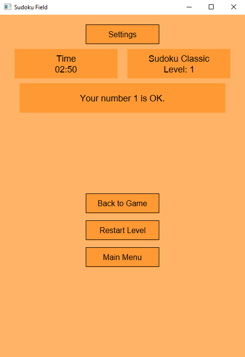